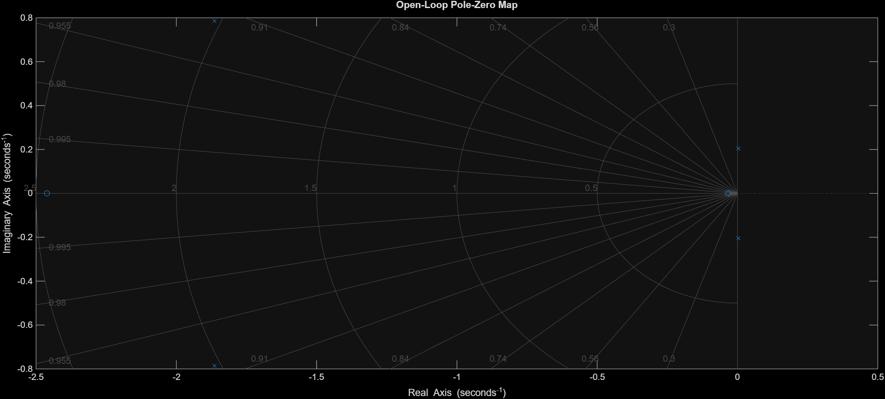
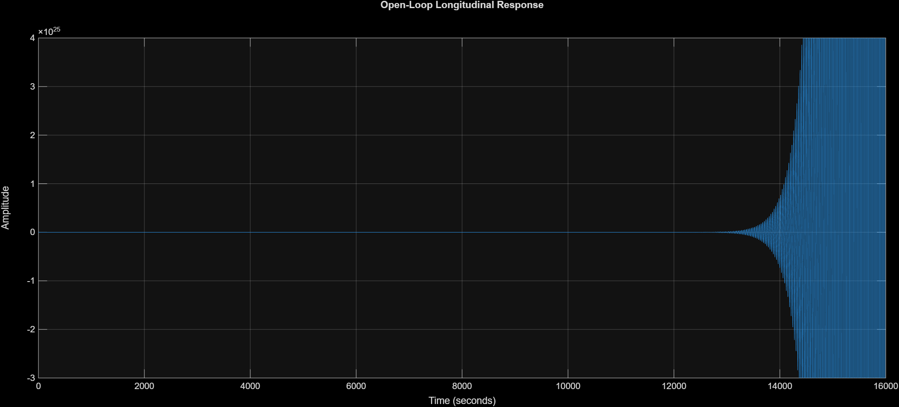
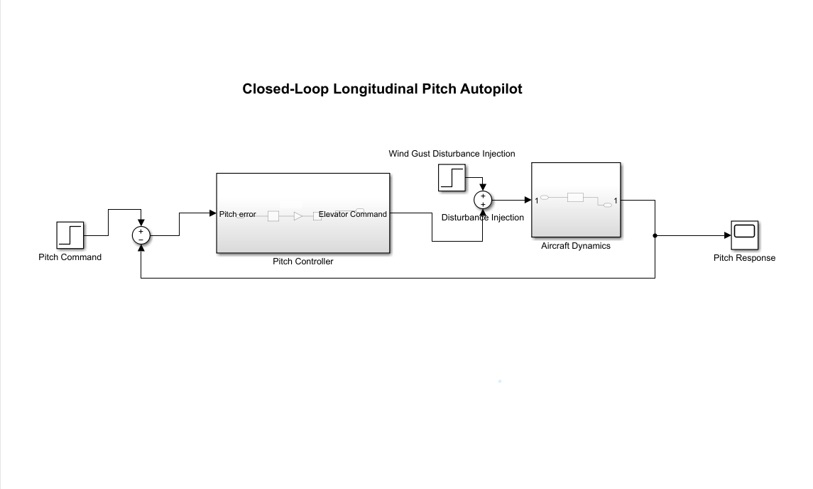
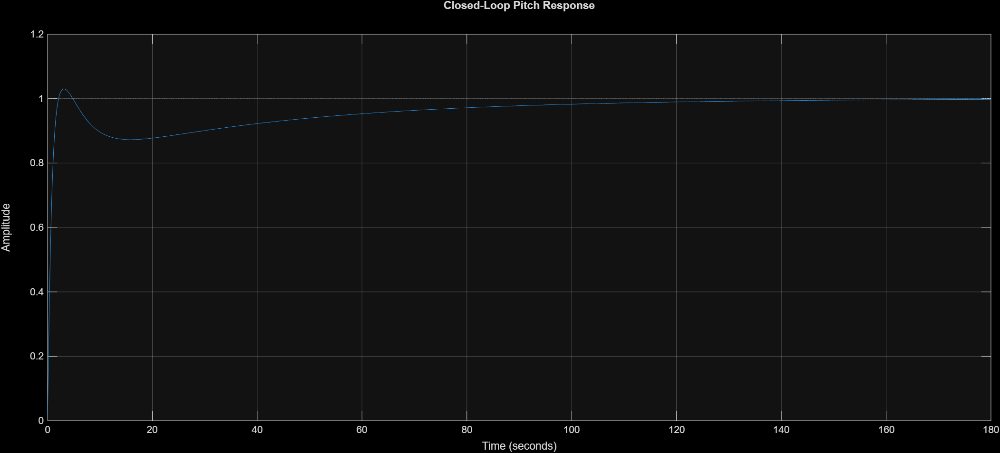
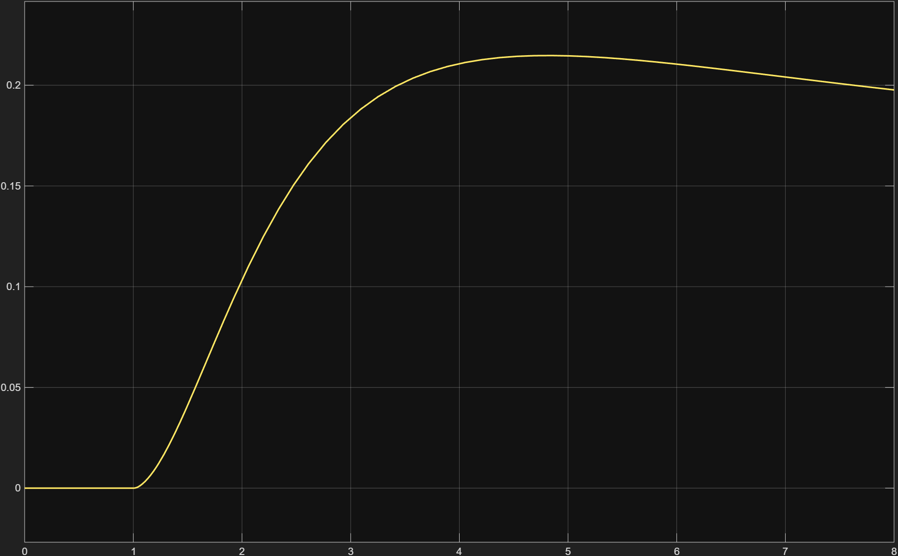
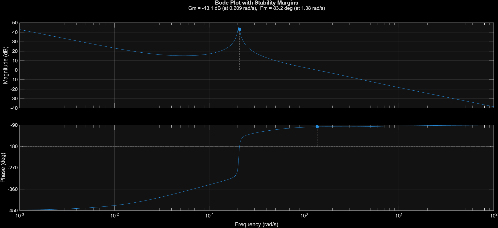
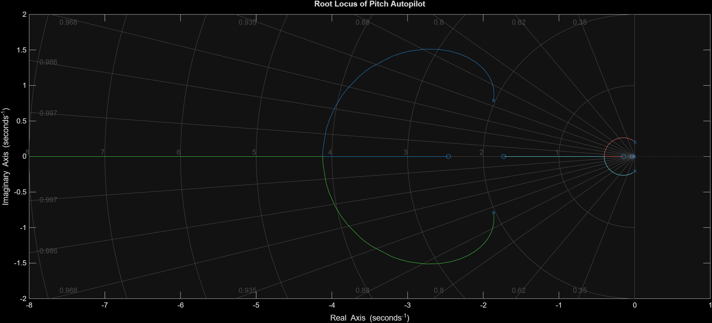

# Aerosonde UAV Pitch Autopilot

A MATLAB and Simulink based closed-loop longitudinal pitch autopilot system developed for an Aerosonde UAV using classical control techniques and state-space modeling.

---

# Project Overview

This project focuses on the design and analysis of a longitudinal pitch autopilot for an Aerosonde UAV. The complete control system was modeled in MATLAB and Simulink using state-space aircraft dynamics and PID-based feedback control.

The project includes:

- Longitudinal aircraft dynamics modeling
- State-space representation
- Open-loop stability analysis
- Pole-zero and eigenvalue analysis
- PID controller design and tuning
- Closed-loop pitch stabilization
- Disturbance rejection analysis
- Frequency-domain stability analysis
- Simulink implementation of the complete autopilot architecture

---

# Project Objectives

- Develop a longitudinal state-space model for the Aerosonde UAV
- Analyse open-loop aircraft stability characteristics
- Design a PID-based pitch autopilot controller
- Improve transient and steady-state response
- Perform root locus and frequency-domain analysis
- Implement and validate the controller in Simulink

---

# Aircraft Longitudinal Model

The aircraft longitudinal dynamics were modeled using the following state variables:

- Forward velocity perturbation (u)
- Angle of attack (α)
- Pitch rate (q)
- Pitch angle (θ)

The system was represented in state-space form:

```math
ẋ = Ax + Bu
y = Cx + Du
```

The open-loop eigenvalue analysis showed unstable longitudinal dynamics, requiring closed-loop stabilization using feedback control.

---

# Open-Loop Stability Analysis

The open-loop aircraft model showed unstable poles in the right-half plane.

### Open-Loop Pole-Zero Map



### Open-Loop Response



---

# PID Controller Design

A PID controller was designed to stabilize the aircraft pitch dynamics.

The controller gains were tuned iteratively in Simulink to achieve:

- Low overshoot
- Improved settling time
- Stable steady-state tracking
- Good disturbance rejection

Final tuned gains:

| Parameter | Value |
|---|---|
| Kp | 0.8 |
| Ki | 0.05 |
| Kd | 0.3 |

A reverse control action was implemented using a gain block of -1 to correctly model elevator dynamics.

---

# Simulink Closed-Loop Architecture

The complete closed-loop pitch autopilot architecture was implemented in Simulink.

The model includes:

- Pitch command input
- Error computation
- PID controller subsystem
- Elevator command generation
- Aircraft longitudinal dynamics subsystem
- Wind disturbance injection
- Feedback loop
- Pitch response visualization

### Final Simulink Architecture



---

# Closed-Loop Pitch Response

The PID controller successfully stabilized the aircraft longitudinal dynamics.

### Closed-Loop Response



### Performance Metrics

| Metric | Value |
|---|---|
| Rise Time | 1.30 s |
| Settling Time | 94.01 s |
| Overshoot | 2.99 % |
| Peak Time | 3.13 s |
| Steady-State Value | 0.9968 |

---

# Disturbance Rejection Analysis

A disturbance input representing wind gusts was added to the aircraft dynamics input channel.

The controller successfully rejected disturbances while maintaining stable pitch tracking.

### Disturbance Rejection Response



---

# Frequency Domain Analysis

Frequency-domain analysis was performed using Bode plots and stability margins.

### Bode Plot



### Stability Margins

| Parameter | Value |
|---|---|
| Gain Margin | 0.0070 |
| Phase Margin | 83.22° |
| Gain Crossover Frequency | 0.2085 rad/s |
| Phase Crossover Frequency | 1.3786 rad/s |

The system demonstrated strong phase stability and acceptable robustness.

---

# Root Locus Analysis

Root locus analysis was used to study pole movement and controller effects on stability.

### Root Locus Plot



---

# Repository Structure

```text
Aerosonde-UAV-Pitch-Autopilot/
│
├── matlab/
│   ├── aircraft_parameters.m
│   ├── longitudinal_model.m
│   ├── open_loop_analysis.m
│   ├── performance_analysis.m
│   └── frequency_analysis.m
│
├── simulink/
│   ├── open_loop_longitudinal.slx
│   └── closed_loop_pitch_autopilot.slx
│
├── plots/
│   ├── bode_plot.png
│   ├── closed_loop_response.png
│   ├── disturbance_rejection.png
│   ├── final_simulink_architecture.png
│   ├── open_loop_Longitudinal_Response.png
│   ├── open_loop_pole_zero_Map.png
│   └── root_locus.png
│
├── docs/
│   └── Professional Aerosonde Pitch Autopilot Report.docx
│
├── report/
│   └── Aerosonde_UAV_Pitch_Autopilot_Report.pdf
│
└── README.md
```

---

# Tools Used

- MATLAB
- Simulink
- Control System Toolbox
- State-Space Modeling
- PID Control
- Git
- GitHub

---

# Key Learning Outcomes

- Aircraft longitudinal dynamics modeling
- State-space system analysis
- Classical control system design
- PID tuning techniques
- Frequency-domain stability analysis
- Simulink closed-loop implementation
- Engineering documentation and version control

---

# Author

### Shashwat Agrawal

Aeronautical Engineering Student  
MIT Manipal

---
